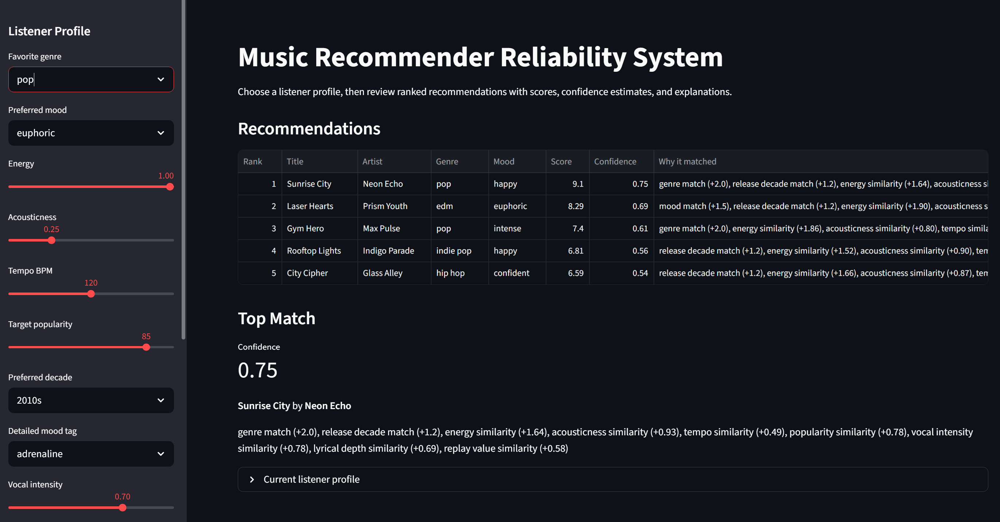
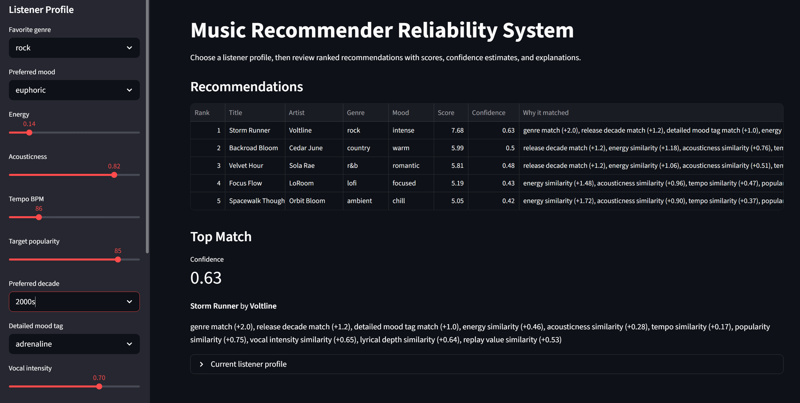
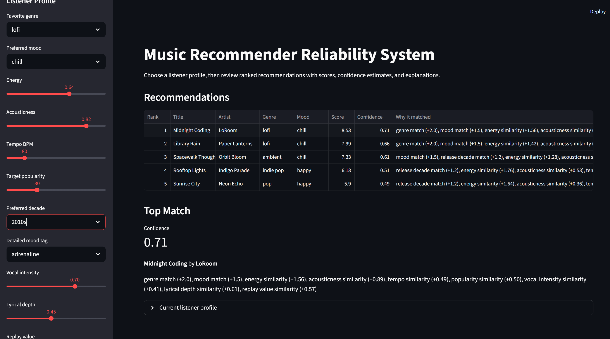

# Applied AI System Project

## Music Recommender Reliability System

## Documentation Overview

This README is written for a future employer or reviewer who wants to understand what the project does, how it is organized, how to run it, and how I checked that it works. The project builds on earlier module work in debugging, system design, recommender reasoning, and reliability testing.

## Original Project

My original Modules 1-3 project was the **Music Recommender Simulation**. Its goal was to recommend songs from a small catalog by comparing a listener's taste profile against song features such as genre, mood, energy, acousticness, tempo, popularity, and replay value. The original version could load songs from a CSV file, score each song, rank the strongest matches, and explain why each recommendation was chosen.

## Title and Summary

**Music Recommender Reliability System** is a content-based AI recommender that suggests songs for different listener profiles and explains the reasoning behind each result. The system matters because recommendation tools influence what people discover, so even a small classroom model should be understandable, testable, and honest about its limits.

This project extends the original recommender into a more complete applied AI system by adding clearer architecture documentation, multiple evaluation profiles, explanation output, diversity adjustment, and reliability tests. Instead of only producing a ranked list, the system shows how the recommendation was made and gives a future developer a way to check whether the behavior still works after changes.

The advanced AI feature I focused on is a **reliability and testing system**. The recommender is not treated as a black box: its outputs are explained, tested, and reviewed against different listener profiles, including edge cases where the catalog may not contain a perfect match.

The AI implementation is the recommender in `src/recommender.py`. It uses rule-based content scoring, confidence scoring, ranking, explanation generation, and diversity penalties to make music recommendations from structured song data.

## Architecture Overview

The system starts with a human-created listener profile and a local song catalog in `data/songs.csv`. `src/main.py` loads the catalog, sends each profile to the recommender, and prints the ranked results. `src/recommender.py` contains the core AI logic: scoring, ranking, explanation generation, scoring modes, and diversity adjustment.

The system diagram is documented in [step 2. Design and Architecture.md](<step 2. Design and Architecture.md>). In short, the data flow is:

```text
User Profile -> Song Catalog Loader -> Recommender Scoring -> Diversity Adjustment -> Ranked Recommendations -> Human Review
```

Testing is part of the architecture too. The tests in `tests/test_recommender.py` check that the recommender returns ranked songs and produces usable explanations. Human review is also important because music recommendations are partly subjective; the tests can catch broken behavior, while a person can judge whether the results feel reasonable.

Main project files:

- `src/main.py`: Runs the recommendation demo and prints results.
- `src/recommender.py`: Contains the scoring, ranking, explanation, and diversity logic.
- `data/songs.csv`: Stores the music catalog.
- `tests/test_recommender.py`: Provides reliability checks.
- `model_card.md`: Documents responsible-use limits and evaluation notes.

## Setup Instructions

1. Clone or download this repository.

2. Open a terminal in the project folder.

3. Create a virtual environment:

   ```bash
   python -m venv .venv
   ```

4. Activate the virtual environment.

   Windows:

   ```bash
   .venv\Scripts\activate
   ```

   Mac or Linux:

   ```bash
   source .venv/bin/activate
   ```

5. Install dependencies:

   ```bash
   pip install -r requirements.txt
   ```

6. Run the recommender:

   ```bash
   python -m src.main
   ```

7. Run the browser app:

   ```bash
   python -m streamlit run streamlit_app.py
   ```

8. Run the tests:

   ```bash
   python -m pytest
   ```

## Sample Interactions

The current application runs several built-in evaluation profiles. Each profile acts like a sample user input, and the output is a ranked recommendation table with explanations.

## Demo Walkthrough

Demo video or walkthrough:

```text
Loom link:
```

The walkthrough should show the system running end-to-end:

1. Open the browser app with `python -m streamlit run streamlit_app.py`.
2. Change the listener profile controls in the sidebar.
3. Review the AI-generated recommendations, confidence scores, and explanations.





### Example 1: High-Energy Pop

Input profile:

```python
{
    "genre": "pop",
    "mood": "happy",
    "energy": 0.8,
    "acousticness": 0.25,
    "tempo_bpm": 120,
    "target_popularity": 85,
    "preferred_decade": "2010s",
    "detailed_mood_tag": "uplifting",
}
```

Output:

```text
1. Sunrise City by Neon Echo - Score: 10.46, Confidence: 0.99
   Reasons: genre match, mood match, release decade match, detailed mood tag match,
   strong energy/acousticness/tempo/popularity similarity

2. Gym Hero by Max Pulse - Score: 6.89, Confidence: 0.65
   Reasons: genre match, strong energy similarity, but includes a genre diversity penalty

3. Rooftop Lights by Indigo Parade - Score: 6.32, Confidence: 0.60
   Reasons: mood match, release decade match, and close audio-feature similarity
```

### Example 2: Chill Lofi

Input profile:

```python
{
    "genre": "lofi",
    "mood": "chill",
    "energy": 0.38,
    "acousticness": 0.80,
    "tempo_bpm": 78,
    "target_popularity": 68,
    "preferred_decade": "2020s",
    "detailed_mood_tag": "study",
}
```

Output:

```text
1. Midnight Coding by LoRoom - Score: 10.45, Confidence: 0.99
   Reasons: genre match, mood match, release decade match, detailed mood tag match,
   and close energy/acousticness/tempo similarity

2. Library Rain by Paper Lanterns - Score: 9.25, Confidence: 0.87
   Reasons: genre match, mood match, release decade match, and strong acoustic fit

3. Focus Flow by LoRoom - Score: 7.01, Confidence: 0.66
   Reasons: genre match and strong feature similarity, reduced by artist and genre diversity penalties
```

### Example 3: Edge Case - Sad but High Energy

Input profile:

```python
{
    "genre": "pop",
    "mood": "sad",
    "energy": 0.90,
    "acousticness": 0.20,
    "tempo_bpm": 130,
    "target_popularity": 80,
    "preferred_decade": "2020s",
    "detailed_mood_tag": "somber",
}
```

Output:

```text
1. Gym Hero by Max Pulse - Score: 8.25, Confidence: 0.78
   Reasons: genre match, release decade match, and strong energy/tempo similarity

2. Sunrise City by Neon Echo - Score: 7.03, Confidence: 0.66
   Reasons: genre match and close audio-feature similarity, reduced by genre diversity penalty

3. Sunset Motion by Luna Caribe - Score: 5.10, Confidence: 0.48
   Reasons: release decade match and close energy/acousticness/popularity similarity
```

This edge case shows a limitation: the catalog does not contain many sad, high-energy songs, so the system falls back to the closest available feature matches.

## Design Decisions

I built this as a content-based recommender because the dataset contains direct song attributes, not user listening histories. That makes the system transparent: each recommendation can be explained through visible features instead of hidden user behavior.

The scoring system uses weighted feature matching. Exact matches like genre and mood receive points, while numeric features like energy and tempo receive similarity points based on how close they are to the user's target. I also added scoring modes, such as `genre_first`, so the system can model different recommendation priorities.

The biggest trade-off is simplicity versus realism. A real music platform would use much more data, including listening behavior, collaborative filtering, embeddings, skips, likes, and playlist context. This project chooses a smaller and clearer model so the reasoning can be inspected, tested, and explained.

I also chose to include explanations with every recommendation. This makes the output more transparent, but it also exposes the limits of the scoring system. For example, if a recommendation appears because of energy and genre but not mood, the explanation makes that compromise visible.

## Testing Summary

The project includes tests in `tests/test_recommender.py`. These tests check that recommendations are returned in ranked order and that explanations are non-empty strings. This is a starting reliability system: it helps confirm that the recommender still behaves consistently after code changes.

Latest reliability result:

```text
5 out of 5 automated tests passed.
The app loaded 18 songs and generated recommendations for 4 evaluation profiles.
Confidence scores for top recommendations ranged from 0.78 to 1.00.
The system struggled most with the "sad but high energy" edge case because the catalog has limited matching songs.
```

What worked:

- The app successfully loads 18 songs from `data/songs.csv`.
- The recommender produces ranked outputs for multiple listener profiles.
- The explanations show which song features contributed to the score.
- Confidence scores make the strength of each recommendation easier to compare.
- The diversity adjustment reduces repeated artists and genres in the top results.

What did not work perfectly:

- The current catalog is small, so some profiles do not have an ideal match.
- The edge case profile, "sad but high energy," exposes a data gap because the dataset does not contain many songs with that combination.
- The system still depends on the quality and coverage of the small local CSV catalog.

What I learned:

- Reliability is not only about whether code runs; it is also about whether the result makes sense for different kinds of inputs.
- Edge cases are useful because they reveal where the model is making compromises.
- Explanations make the recommender easier to debug and easier to trust.

## Reflection

This project taught me that AI systems do not need to be mysterious to be useful. Even a simple recommender makes many design choices: which features matter, how much each feature should count, how to handle missing matches, and how to explain the final answer.

It also showed me that testing and human judgment work best together. Automated tests can confirm that the system returns ranked recommendations and explanations, but human review is still needed to decide whether the recommendations feel fair, diverse, and relevant. Building this system helped me think more like an engineer: not just "Does it work?" but "Can someone else understand it, run it, test it, and trust it?"
