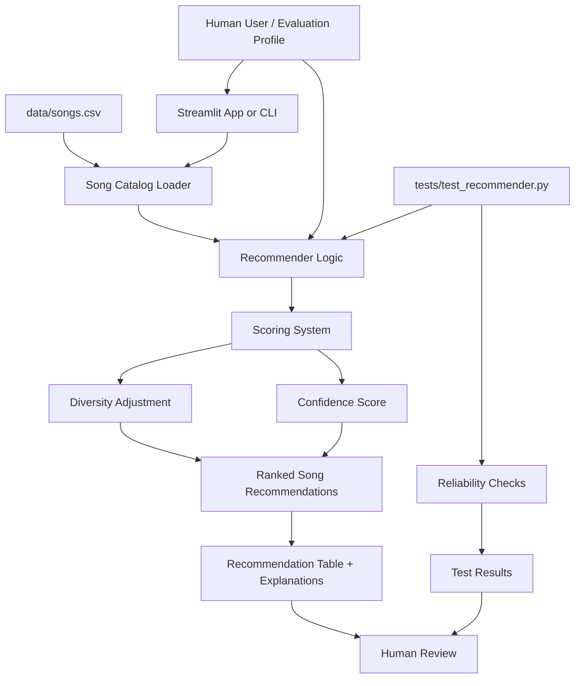

# System Architecture Diagram

The system takes a listener profile and compares it against songs from `data/songs.csv`. The recommender scores each song, adds a confidence estimate, applies a diversity adjustment, and returns ranked recommendations with explanations. Automated tests and human review are used to check whether the AI output is reliable and reasonable.
