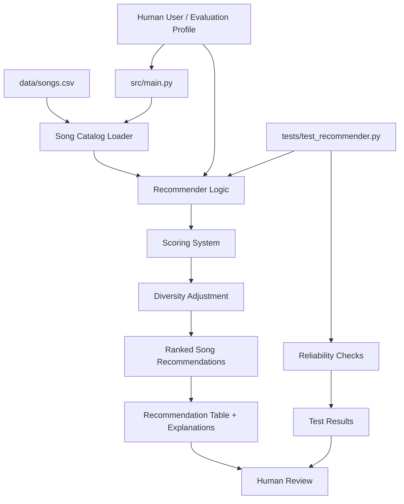

# Step 2: Design and Architecture

## How the System Fits Together

This project is organized as a small AI-style music recommender system. A user taste profile is used as input, the song catalog is loaded from a CSV file, the recommender scores and ranks songs, and the system outputs a short list of recommended songs with explanations. Testing and human review are used to check whether the recommendations make sense.

## System Diagram

## Component Roles

- `src/main.py`: Runs the application, defines evaluation profiles, loads songs, and prints recommendation results.
- `data/songs.csv`: Stores the song catalog used by the recommender.
- `src/recommender.py`: Contains the main recommendation logic, scoring rules, ranking behavior, explanations, and diversity adjustment.
- `tests/test_recommender.py`: Checks that the recommender returns reasonable results and explanations.
- Human review: The developer checks whether the output recommendations make sense for each profile, especially edge cases.

## Data Flow

1. A human-created profile describes the listener's preferred genre, mood, energy, acousticness, tempo, and other music traits.
2. The system loads song data from `data/songs.csv`.
3. Each song is scored against the user profile using weighted feature matching.
4. The recommender ranks the songs from strongest match to weakest match.
5. A diversity adjustment helps avoid overly repetitive recommendations.
6. The final recommendations are printed with scores and explanations.
7. Tests and human review check whether the results are reliable and reasonable.

## Human and Testing Involvement

Humans are involved in two places. First, the evaluation profiles are designed by a person to represent different kinds of listeners. Second, the final recommendation tables are reviewed to see whether the results feel appropriate.

Testing is handled through `pytest`. The tests check that the recommender returns ranked songs and produces non-empty explanations. These tests help make sure the system behaves consistently when the code changes.
